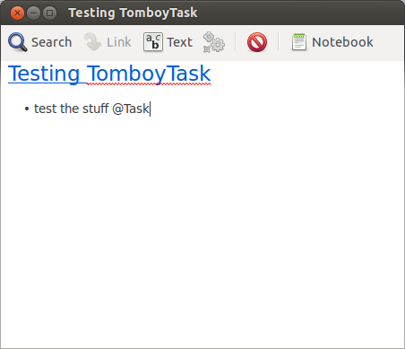
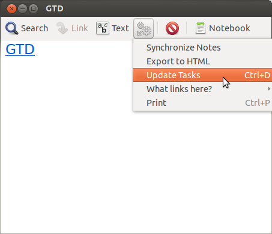
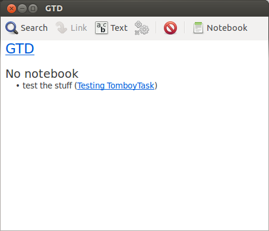
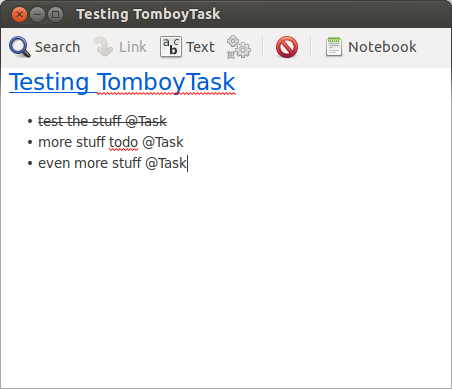
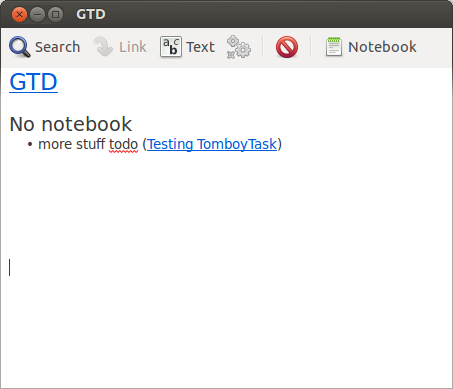
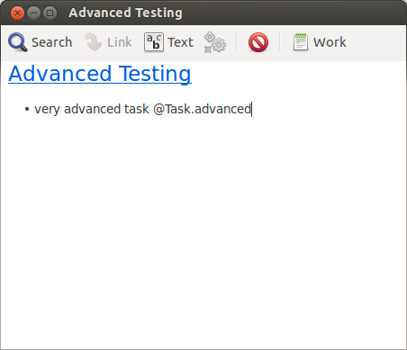
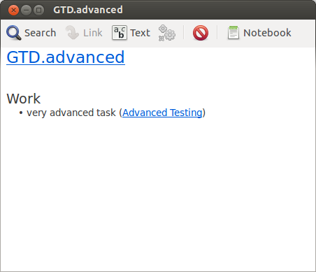
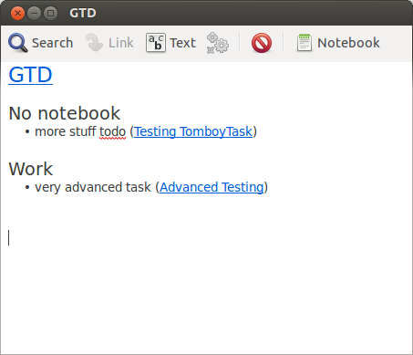

Usage
-----

Collects your tasks from all your Tomboy notes which comes in handy when you use Tomboy for Getting Things Done (GTD).
Support contexts and ignores done tasks.

* status: 0.1.0 (alpha)
* tested with: Ubuntu 12.04 12.10
* requires: tomboy libgtk2.0-cil-dev libmono-posix4.0-cil

Mark and Collect Tasks
----------------------

* Create a bullet point within a Note and add "@Task".  
  
* Create your task list called "GTD". This one gets an additional tool called "Update Tasks".  
  
* Update the list and have a look at your tasks, ordered by notebook.  

One Task per Note
-----------------
* TomboyTask ignores tasks your striked out.  
  
* if your note contains more than one task only the first not finished task is shown.  

Use Contexts
------------
* add a context to specify tasks.  
  
* now you can create a specific task list called "GTD.advanced" to show only tasks for this context.  
  
* The generic "GTD" note will collect all tasks, disregarding the context  

Installation Instructions
-------------------------

Change into the source directory and execute:  

	dmcs -debug -out:TomboyTask.dll -target:library TomboyTaskNoteAddin.cs -res:TomboyTask.addin.xml -pkg:gtk-sharp-2.0,tomboy-addins -r:/usr/lib/mono/4.0/Mono.Posix.dll

The dll has to be copied into the addin directory of tomboy.  
Under Linux:  

	cp TomboyTask.dll ~/.config/tomboy/addins/

More info: https://live.gnome.org/Tomboy/PluginList
